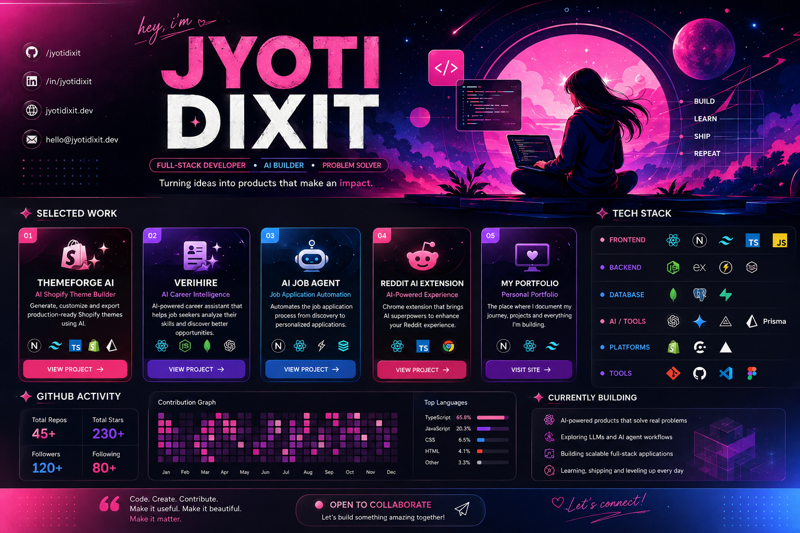

 

# ✦ Building ideas into real products.

### `FULL-STACK DEVELOPMENT` · `AI ENGINEERING` · `PRODUCT BUILDING`

I build modern web applications, experiment with AI,
and turn interesting ideas into things people can actually use.

 

&nbsp;

&nbsp;

---

## ✦ WHAT I WORK ON

<table>
<tr>
<td align="center" width="25%">

### 🤖

**AI PRODUCTS**

LLM applications
AI workflows
Intelligent features

</td>

<td align="center" width="25%">

### ◈

**FULL-STACK**

Modern web apps
APIs & databases
Scalable architecture

</td>

<td align="center" width="25%">

### ✦

**PRODUCTS**

Ideas → prototypes
UX → implementation
Build → ship

</td>

<td align="center" width="25%">

### ⌁

**EXPERIMENTS**

Developer tools
Browser extensions
New technologies

</td>
</tr>
</table>

---

## 🧩 TECHNOLOGY

### Frontend

### Backend & Database

### AI, Platforms & Tools

 

`Gemini` · `LLM APIs` · `Shopify` · `ImageKit` · `Clerk`

---

# ✦ SELECTED WORK

<table>
<tr>
<td width="50%" valign="top">

## 🌸 ThemeForge AI

**AI Shopify Theme Builder**

Generate Shopify storefronts from natural-language prompts, preview them live, edit sections with AI, and export production-ready themes.

**Built with**

`Next.js` `React` `Tailwind`
`Shopify` `AI` `ImageKit`

**[→ VIEW PROJECT](https://theme-forge-ai.vercel.app/)**

</td>

<td width="50%" valign="top">

## 💜 VeriHire

**AI Career Intelligence**

An AI-powered career intelligence platform designed to help users understand their skills, explore opportunities, and make better career decisions.

**Focus**

`AI` `Career Intelligence`
`Resume Analysis` `Recommendations`

**[→ VIEW PROJECT](https://veri-hire-web.vercel.app/)**

</td>
</tr>

<tr>
<td width="50%" valign="top">

## 💙 AI Job Application Agent

**AI-powered application workflow**

An AI-driven system exploring how repetitive parts of the job-search and application process can be automated.

**Built with**

`Next.js` `React` `Supabase`
`Browserbase` `AI`

**[→ VIEW PROJECT](https://ai-job-application-agent-mu.vercel.app/)**

</td>

<td width="50%" valign="top">

## 🩷 Reddit AI Extension

**AI-powered browser extension**

A Chrome extension experiment that brings AI-powered functionality directly into the Reddit experience.

**Built with**

`React` `TypeScript` `WXT`
`Tailwind` `Gemini`

**[→ VIEW PROJECT](https://github.com/jyotidxt/reddit-chromeExtension)**

</td>
</tr>

<tr>
<td width="50%" valign="top">

## ✦ Personal Portfolio

**My corner of the web**

A personal portfolio showcasing my projects, experiments, skills, and the things I'm currently building.

**Built with**

`YOUR_PORTFOLIO_STACK`

**[→ VISIT PORTFOLIO](https://jyoti-portfolio-cyan.vercel.app/)**

</td>

<td width="50%" valign="top">

## + More experiments

Not everything I build becomes a featured project.

I also experiment with:

`AI` · `Web Development` · `Browser Extensions` · `Automation` · `Developer Tools`

**[→ VIEW ALL REPOSITORIES](https://github.com/jyotidxt?tab=repositories)**

</td>
</tr>
</table>

---

## ◌ CURRENTLY

<table>
<tr>
<td>

**01 — Building**

AI-powered full-stack products

</td>
<td>

**02 — Exploring**

LLMs & intelligent workflows

</td>
<td>

**03 — Improving**

Architecture & problem solving

</td>
</tr>
</table>

---

## ✦ GITHUB

  

---

## ✦ A FEW THINGS ABOUT HOW I BUILD

<table>
<tr>
<td align="center">

**01**

### Start curious.

I like exploring an idea before deciding what it should become.

</td>

<td align="center">

**02**

### Build it.

Learning becomes much more interesting when there's something real to show.

</td>

<td align="center">

**03**

### Make it better.

Build → break → learn → improve → repeat.

</td>
</tr>
</table>

---

## ✧ LET'S BUILD SOMETHING

I'm always interested in interesting ideas, ambitious projects,
and the intersection of **AI × Web × Product**.

 

 

  

`© 2026 Jyoti Dixit 💙`

